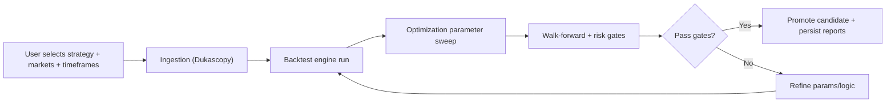
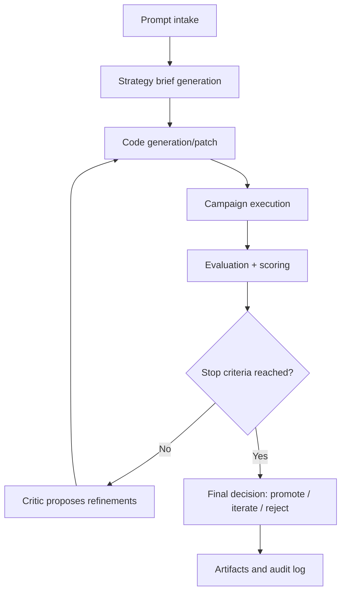
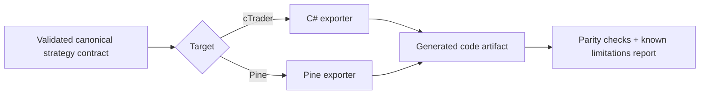

# System Flows

This document summarizes the main project flows.

## 1) Development / Backtest / Optimization Flow

```mermaid
flowchart LR
    A["User selects strategy + markets + timeframes"] --> B["Ingestion (Dukascopy)"]
    B --> C["Backtest engine run"]
    C --> D["Optimization parameter sweep"]
    D --> E["Walk-forward + risk gates"]
    E --> F{"Pass gates?"}
    F -- Yes --> G["Promote candidate + persist reports"]
    F -- No --> H["Refine params/logic"]
    H --> C
```

## 2) Autonomous Strategy Lab Flow (M4)

```mermaid
flowchart TD
    A["Prompt intake"] --> B["Strategy brief generation"]
    B --> C["Code generation/patch"]
    C --> D["Campaign execution"]
    D --> E["Evaluation + scoring"]
    E --> F{"Stop criteria reached?"}
    F -- No --> G["Critic proposes refinements"]
    G --> C
    F -- Yes --> H["Final decision: promote / iterate / reject"]
    H --> I["Artifacts and audit log"]
```

## 3) Export Flow (cTrader / Pine)

```mermaid
flowchart LR
    A["Validated canonical strategy contract"] --> B{"Target"}
    B -- cTrader --> C["C# exporter"]
    B -- Pine --> D["Pine exporter"]
    C --> E["Generated code artifact"]
    D --> E
    E --> F["Parity checks + known limitations report"]
```
